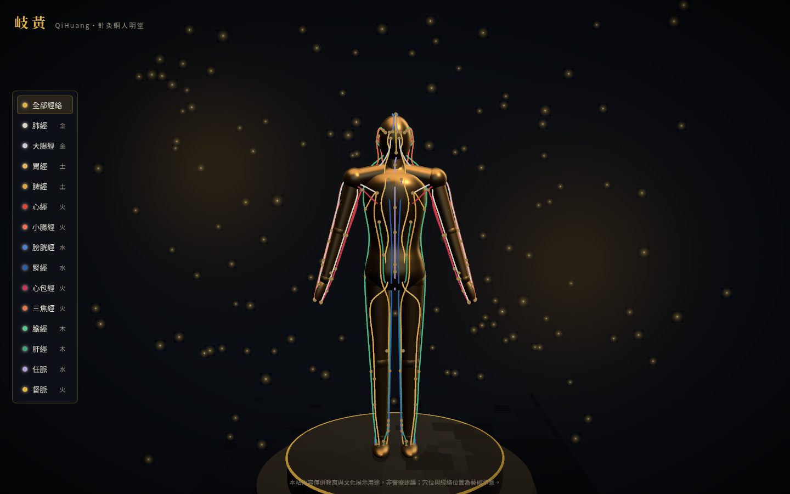
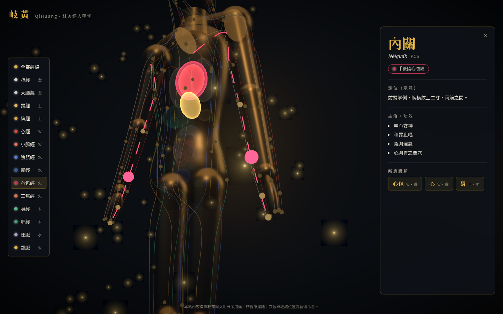

# 岐黃 QiHuang — 3D 針灸銅人互動網站

> 循經取穴・銅人明堂。以 Three.js 打造的中醫形象網站：一尊程式生成的「針灸銅人」、十四經絡、67 個代表穴位，點穴透視其所應之臟腑。


## 專案簡介

宋天聖年間，王惟一鑄銅人兩尊，刻穴以教針灸——本站以之為靈感，將銅人搬進瀏覽器：

- **鎏金銅人**：立於漆黑臺座上的雕像，緩緩旋轉於水墨金塵之間
- **十四經絡**：十二正經＋任督二脈，依五行配色（木青・火赤・土黃・金白・水藍），選中經絡呈現「氣」流動的光線動畫
- **點穴透視**：點選任一穴位，鏡頭聚焦、銅身漸透，體內對應的臟腑發光浮現
- **穴位資訊**：穴名、拼音、國際代碼、定位、主治功效、所應臟腑與五行屬性




## 沒有 3D 建模師，銅人哪來的？

全部由程式碼參數化生成（`src/lib/anatomy.ts` 是唯一的比例來源）：

- 軀幹＝車削曲面（LatheGeometry）壓扁成橢圓截面；頭＝橢球；四肢＝漸縮圓柱＋關節球——合併成單一 geometry
- 經絡與穴位不是手擺的：每個點都是「身體錨點」（軀幹表面 `(高度, 方位角)`、肢段 `(t, 繞軸角)`⋯），由解析器算到體表，左右側自動鏡射
- 因為人體、經絡、穴位共用同一份骨架定義，改比例永遠不會跑位

## 技術架構

| 層 | 選擇 |
|---|---|
| 框架 | React 19 + @react-three/fiber 9 + drei 10 |
| 3D | three 0.185（Line2 經絡線、InstancedMesh 穴位、CameraControls 運鏡） |
| 後製 | @react-three/postprocessing（選擇性 Bloom + Vignette） |
| 狀態 | zustand 5 |
| 建置 | Vite 7 + TypeScript 5.9（strict） |
| 字型 | Noto Serif TC / Noto Sans TC（Fontsource 自架、unicode-range 切片，無 CDN） |

零外部 3D 資產、零 runtime CDN 相依；全案僅一個自訂 shader（臟腑加法混合光暈）。

## 開發

需求：Node ≥ 22。

```bash
npm install
npm run dev            # 開發伺服器
npm run typecheck      # TypeScript strict 檢查
npm run validate:data  # 資料完整性 + 全部錨點解析範圍驗證
npm run build          # typecheck + 產出 dist/
npm run smoke          # 無頭瀏覽器視覺驗證（先 build；截圖存 screenshots/）
```

實用網址參數：`?debug`（骨架地標）、`?az=90`（固定方位角、跳過開場）。

### 無頭視覺驗證

`npm run smoke` 以 playwright-core 驅動無頭 Chromium（SwiftShader 軟體算圖，旗標見
`scripts/smoke.mjs`），完整走過「開場 → 進入 → 選經絡 → 點穴透視 → 復位 → 行動視口」，
斷言面板內容與 console 零錯誤，並輸出全流程截圖——這也是本專案沒有設計師時的「美術驗收迴圈」。

### 版本注意事項

- `@types/three` 必須與 `three` 的 minor 版本同步升級（0.185 ↔ 0.185）
- 不要另行安裝 `postprocessing`——由 `@react-three/postprocessing` 自帶，避免重複副本
- 禁用 drei `<Environment preset>`（runtime 抓 CDN HDRI）；本案用 `<Lightformer>` 程序化環境光

## 手動部署

`npm run build` 後將 `dist/` 上傳任一靜態主機即可（`base` 已設為相對路徑，可放任意子路徑）。
GitHub Pages 快速部署：`npx gh-pages -d dist`。

## 資料說明與免責聲明

經絡路線、穴位定位與臟腑造型皆為**藝術示意**，內容依一般中醫教育知識整理，
僅供教育與文化展示用途，**非醫療建議**。

## 授權

程式碼 MIT；字型 Noto Serif TC / Noto Sans TC 依 SIL OFL 1.1（經 Fontsource 發佈）。
