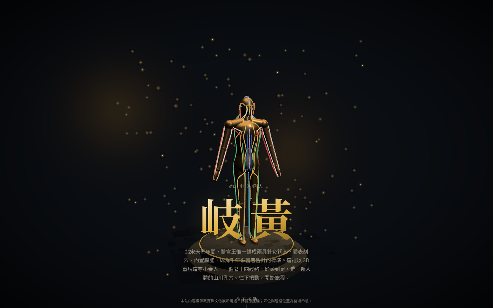
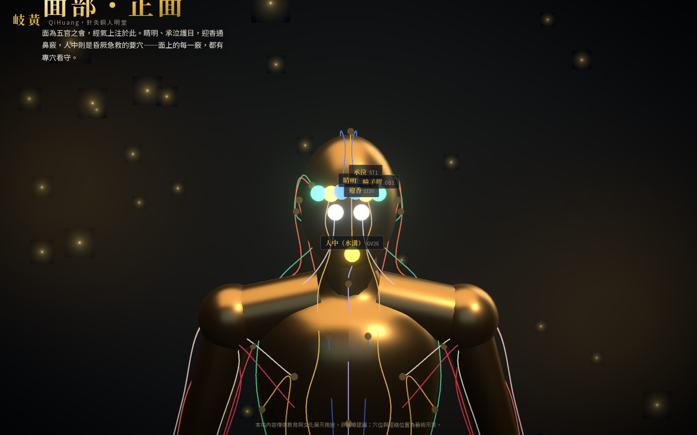
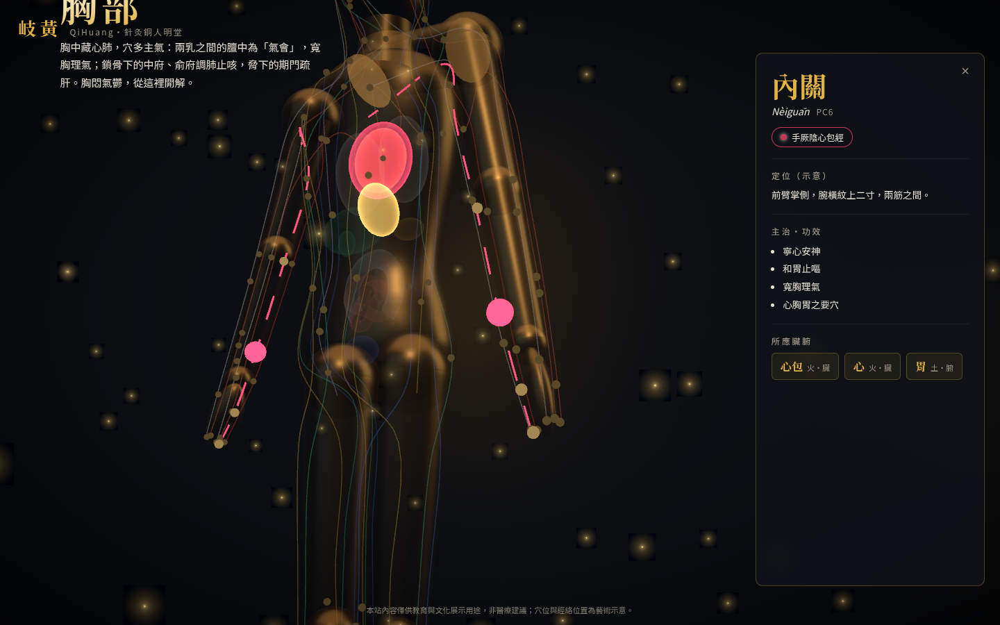

# 岐黃 QiHuang — 3D 針灸銅人滾動敘事網站

> 循經取穴・銅人明堂。以 Three.js 打造的中醫形象網站：一頁式滾動敘事，
> 銅人隨捲動旋轉運鏡，從頭到足走完十二個部位章節、100 個代表穴位，終章開放自由探索。



## 專案簡介

宋天聖年間，王惟一鑄銅人兩尊，刻穴以教針灸——本站以之為靈感，將銅人搬進瀏覽器：

- **滾動敘事**：Landing 講銅人的故事，往下捲動依序經過 正臉 → 側臉 → 頭頂 → 後腦 →
  頸項 → 上肢 → 胸 → 背 → 腹 → 腰 → 下肢 → 足；鏡頭隨滾動進度連續運鏡（單向環繞，不回頭甩），
  每章穴位逐一點亮、穴名標籤浮現
- **章內微互動**：停駐時可小幅拖曳旋轉視角（放開自動回正）、點選穴位看詳情，滾動仍是主導航
- **點穴透視**：點選任一穴位，鏡頭聚焦、銅身漸透，體內對應的臟腑發光浮現；再捲動即自動退出、平滑接回敘事軌道
- **自由探索（終章）**：解鎖 orbit 互動與探索選單——**經絡**（十四經依五行配色、
  「氣」流動動畫）、**症狀反查**（頭痛/失眠/胃脹⋯選症狀點亮相關穴位群）、
  **配穴組合**（四關、安神對等經典搭配與白話解說）
- **白話解**：100 穴皆有日常語言說明——為什麼對應這些臟腑、生活中什麼情況用得上、怎麼按
- **子午流注時辰鐘**：右下角十二時辰環，即時顯示當令經絡，點時辰直達該經
- **分享深連結**：`?point=LI4` 直達合谷、`?sec=back` 直達背部章；面板內建「複製連結」




## 滾動敘事怎麼做的？

- 版型三層：fixed 全螢幕 canvas（底）→ 文流章節軌道撐高頁面（中）→ fixed overlay UI（頂）
- scroll handler 把連續進度寫入 zustand transient 欄位（不觸發 React 重繪），
  相機在 `useFrame` 以阻尼姿勢追蹤 `evaluatePose(rawProgress)`——平滑手感來自相機端阻尼，
  不需要 lenis / ScrollControls 等額外依賴
- 相機軌道的 azimuth 存「連續實數（累計圈數）」：段間線性插值即作者指定的旋轉方向，
  天然避開最短角問題；章節資料（文案、pose、點亮順序）集中在 `src/data/sections.ts`
- 100 穴的部位分類由 anchor 幾何推導（`src/lib/regions.ts`），`npm run validate:data`
  斷言全覆蓋、軌道單調、與章節收錄一致
- 內容層與幾何層分離：白話解與症狀標籤在 `src/data/plainNotes.ts`（合入
  `Acupoint.plain/.symptoms`），症狀詞彙 `symptoms.ts`、配穴 `combos.ts`、
  流注對映 `flowClock.ts` 皆有驗證（詞彙覆蓋、成員存在、24 小時全覆蓋）

## 沒有 3D 建模師，銅人哪來的？

全部由程式碼參數化生成（`src/lib/anatomy.ts` 是唯一的比例來源）：

- 軀幹＝車削曲面（LatheGeometry）壓扁成橢圓截面；頭＝橢球；四肢＝漸縮圓柱＋關節球——合併成單一 geometry
- 經絡與穴位不是手擺的：每個點都是「身體錨點」（軀幹表面 `(高度, 方位角)`、肢段 `(t, 繞軸角)`⋯），由解析器算到體表，左右側自動鏡射
- 因為人體、經絡、穴位共用同一份骨架定義，改比例永遠不會跑位
- **博物館古銅質感**：金屬 PBR ＋程序化氧化包漿（`src/scene/bronze/bronzeMaterial.ts`，
  以物件空間座標＋法線在 shader 內生成銅綠與磨亮，不需貼圖），離線 Lightformer
  環境反射鋪金屬高光，全身待機微呼吸——往「真·天聖銅人文物」而非「照片級真人」擬真
- **解剖分層**：銅身 → 肌肉 → 骨骼由外而內剝開（`buildSkeleton.ts` 參數化示意骨架，
  與銅身共用同一份 LANDMARKS）。因長骨落在肢段軸上，切到骨骼時依骨度分寸定位的
  穴位正落在對應骨頭；骨架層再浮出肢段量尺（前臂12寸／小腿16寸／大腿19寸）與
  選穴寸數標註——選「內關」即見金框「腕上二寸」標在橈尺骨間，把定位規則演給人看

## 穴位定位：骨度分寸（非目測）

四肢與腹部任脈穴的位置不是憑感覺擺的，而是依 **WHO《Standard Acupuncture
Point Locations in the Western Pacific Region》(2008)** 的**比例骨度法（B-cun）**
推導——把兩解剖標誌間的距離定為固定寸數（如前臂肘橫紋→腕橫紋＝12 寸），
再按穴位標準定位的「X 寸」算出沿肢段的比例。定位層在 `src/lib/cun.ts`：

```ts
// 內關「腕橫紋上二寸」→ 前臂 12 寸的 (12−2)/12 處
anchor: limbCun('aboveWrist', 2, 3.0)
// 關元「臍下三寸」→ 縱向骨度換算高度
anchor: torsoCun(-3, 0)
```

好處是位置**規則推導、可稽核**，相對穴自動一致（內關／外關同為腕上 2 寸 →
同一比例），且日後銅人若換成解剖比例網格，這些比例錨點會自動落在正確位置。
`npm run validate:data` 鎖定換算關係（寸序、相對穴一致性）作回歸防護。
指趾端、掌骨、腓骨小頭等**以解剖標誌定位**者仍用標誌式錨點。

> 註：本銅人為風格化示意體，定位為「規則正確」而非臨床量測級精確；
> 僅供教育與文化展示，非醫療建議。

## 技術架構

| 層 | 選擇 |
|---|---|
| 框架 | React 19 + @react-three/fiber 9 + drei 10 |
| 3D | three 0.185（Line2 經絡線、InstancedMesh 穴位、CameraControls 運鏡） |
| 後製 | @react-three/postprocessing（選擇性 Bloom + Vignette） |
| 狀態 | zustand 5 |
| 建置 | Vite 7 + TypeScript 5.9（strict） |
| 字型 | Noto Serif TC / Noto Sans TC（Fontsource 自架、unicode-range 切片，無 CDN） |

零外部 3D 資產、零 runtime CDN 相依；全案僅一個自訂 shader（臟腑加法混合光暈）。

## 開發

需求：Node ≥ 22。

```bash
npm install
npm run dev            # 開發伺服器
npm run typecheck      # TypeScript strict 檢查
npm run validate:data  # 資料完整性 + 全部錨點解析範圍驗證
npm run build          # typecheck + 產出 dist/
npm run smoke          # 無頭瀏覽器視覺驗證（先 build；截圖存 screenshots/）
```

實用網址參數：`?debug`（骨架地標）、`?az=90`（固定方位角、直接進自由探索）。

### 無頭視覺驗證

`npm run smoke` 以 playwright-core 驅動無頭 Chromium（SwiftShader 軟體算圖，旗標見
`scripts/smoke.mjs`），完整走過「landing → 逐章捲動 → 章內選穴透視 → 滾動退出 →
終章進自由探索 → 選經絡 → 行動視口」，斷言面板內容與 console 零錯誤，
並輸出全流程截圖——這也是本專案沒有設計師時的「美術驗收迴圈」。

### 版本注意事項

- `@types/three` 必須與 `three` 的 minor 版本同步升級（0.185 ↔ 0.185）
- 不要另行安裝 `postprocessing`——由 `@react-three/postprocessing` 自帶，避免重複副本
- 禁用 drei `<Environment preset>`（runtime 抓 CDN HDRI）；本案用 `<Lightformer>` 程序化環境光

## 部署

**GitHub Pages（自動）**：`.github/workflows/deploy.yml` 會在 push 時自動 build 並部署到
GitHub Pages（首次執行會自動啟用 Pages）。需在 repo 的 **Settings → Pages → Build and deployment
→ Source** 設為 **GitHub Actions**（workflow 首跑時 `configure-pages` 也會嘗試自動設定）。
網址：`https://yo02741.github.io/QiHuang/`。

**手動**：`npm run build` 後將 `dist/` 上傳任一靜態主機即可（`base` 已設為相對路徑，可放任意子路徑）。

## 資料說明與免責聲明

經絡路線、穴位定位與臟腑造型皆為**藝術示意**，內容依一般中醫教育知識整理，
僅供教育與文化展示用途，**非醫療建議**。

## 授權

程式碼 MIT；字型 Noto Serif TC / Noto Sans TC 依 SIL OFL 1.1（經 Fontsource 發佈）。
